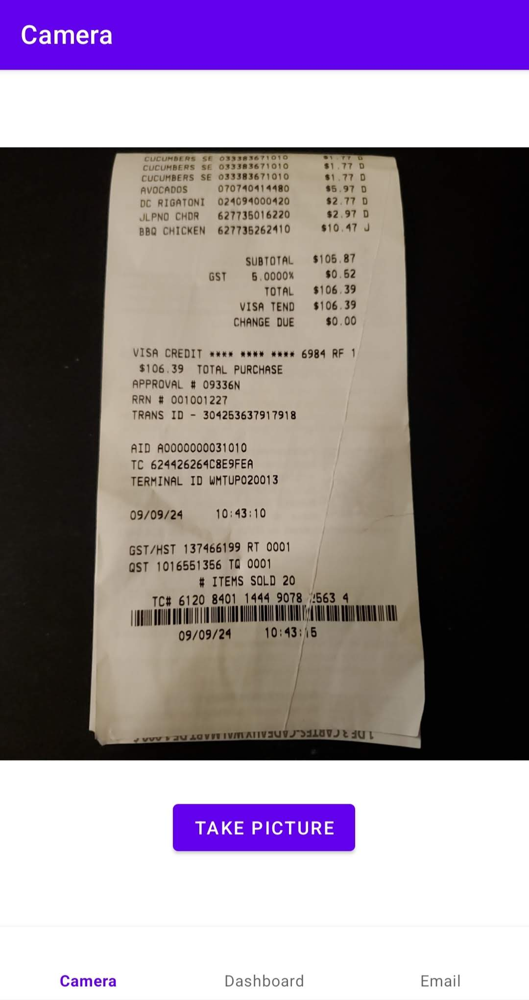
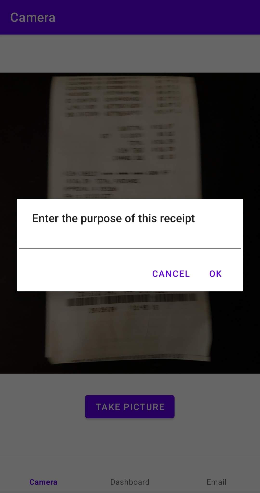
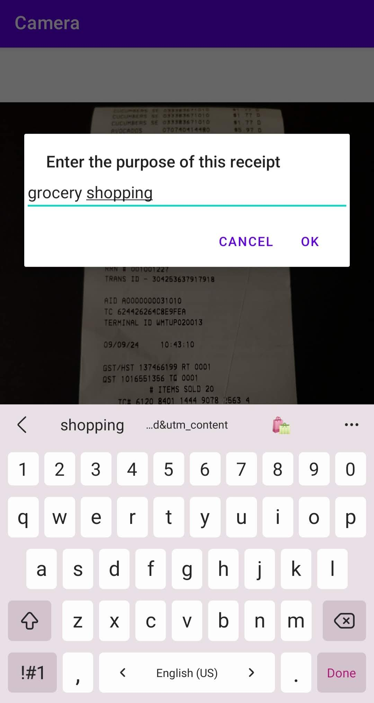
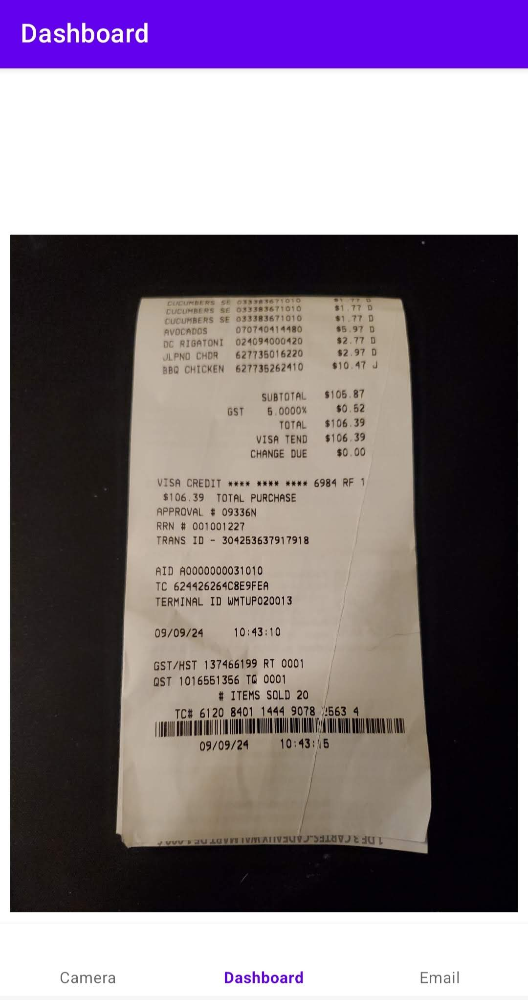
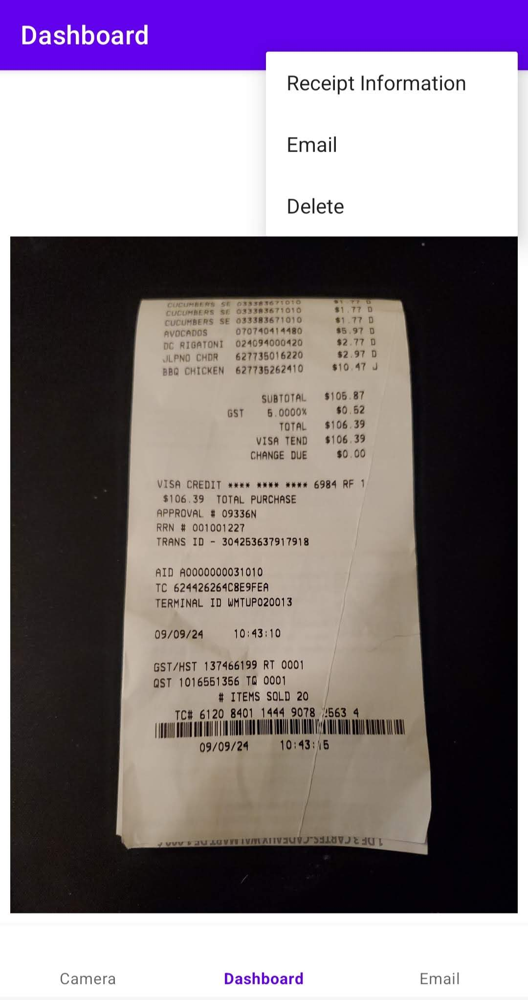
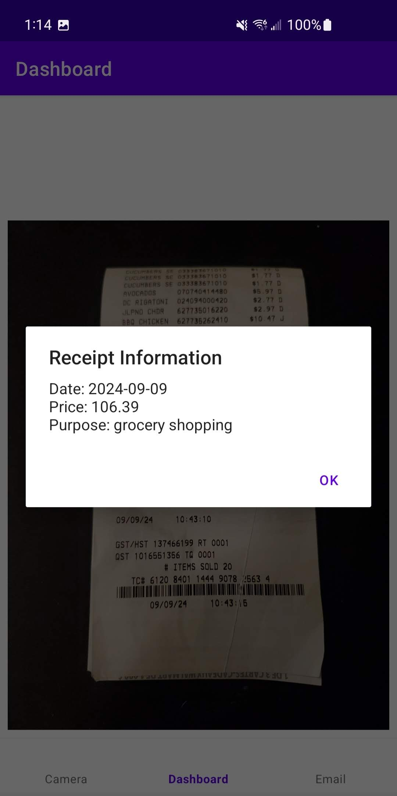
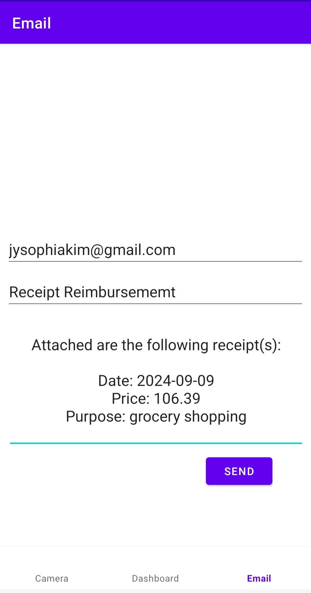

**Receipt Reader Android Mobile App**

This is an Receipt Reader used as an Android Mobile App. Built using Kotlin and XML, I created this app after a need for it was expressed by a family member. My main objective for this project is to use my skill to help others, starting with the people around me. It is currently still in development, but here are the major features:

_User Takes a Picture of their Receipt_

The user can open the app to its camera page and take a picture of the receipt.

_User Writes the Purpose of the Receipt_

The user can write the context of that receipt and it will automatically save with the receipt data.

  
  

_User Views the Receipt on Dashboard_

The user can go to the dashboard tab and see the receipt along with options for what the user can do with it. This includes viewing the receipt information that has been read into the receipt data at the time of taking the picture, deleting the receipt, and emailing the receipt.

  
  
  

_User Emails the Receipt to their Personal Email_

The user can email the receipt, which will generate an automated message with an attachment of the receipt image (still in development) and the receipt information as shown above.

_Final Thoughts_

The hope with this app is to streamline reimbursement processes more seamlessly for the user. In the case where the user is a working professional and their company does not offer a reimbursement system, this would offer an easy way for the user to keep a record of their receipts, email to themselves, and then send it to whoever they need from thereon.
