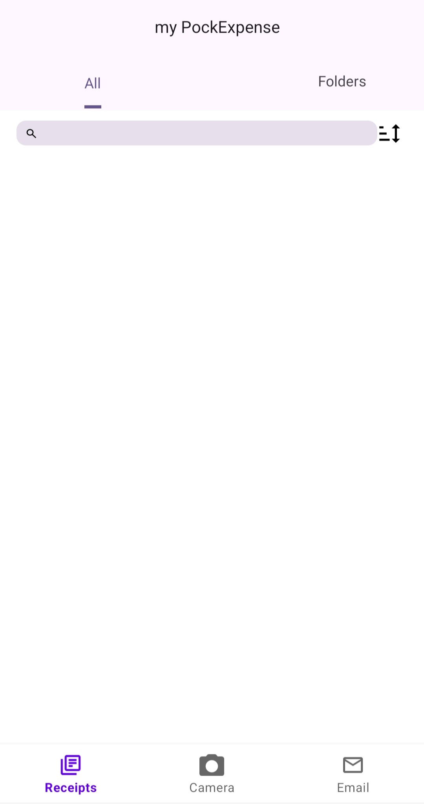
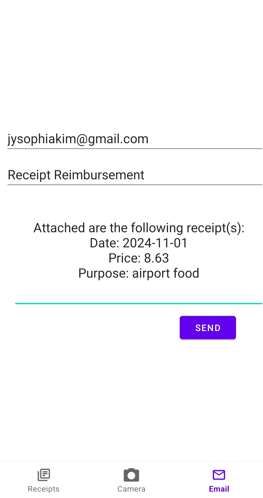

**Receipt Reader Android Mobile App**

This is PockExpense, a receipt reader and compiler to streamline reimbursement processes. I created this app because of a personal request from a family member. My main objective for this project is to use my skill to help others, starting with the people around me. It is currently still in development, but here are the major features:

_User Opens the App to the Home Page_

The home page is where the user will see all of the receipts they uploaded so far. In this case, we start with none.

_User Takes a Picture of their Receipt_

The user can open the app to its camera page and take a picture of the receipt.

_User Writes the Purpose of the Receipt_

The user can write a description for that receipt and confirm the cost and date, which have been scanned for convenience. If any mistakes are found, the user can edit it on the spot.

  
  
  
  

_User Views the Receipt on Dashboard_

The user can go back to the home page and view the receipt along with options for what the user can do with it. It will have a status tag marked as "Pending" before it is reimbursed. Action items include viewing the receipt information, emailing the receipt, and deleting the receipt.

  
  
  
  

_User Emails the Receipt to their Personal Email_

The user can email the receipt, which will generate an automated message with an attachment of the receipt image (still in development) and the receipt information as shown above.

_Tech Stack_

This project uses Kotlin and Android API Frameworks to create the app, Google ML Kit Text Recognition API to parse and store receipt data, JUnit and Mockito to test the features, and Figma and Jetpack Composable to integrate UI designs.

_Final Thoughts_

The focus for this app was to make it as convenient and user-centred as possible. In the case where the user is a working professional and their company does not offer a reimbursement system, this would offer an easy way for the user to keep a record of their receipts, email to themselves, and then send it to whoever they need from thereon.
